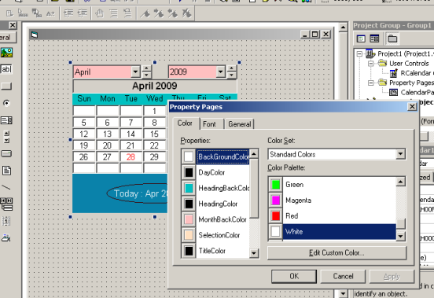



## Custom Calendar Control Version 1\.0

### Description

Custom Calendar Control Ver 1.0

Calendar is generated using the algorithm used in my previous Calendar submission

Features

- You can customize many of the properties according to your requirement like background colors, foreground colors, fonts

- You can hide or display the gridlines

- You can set the first day to be displayed on Calendar heading

- You can resize the Calendar

I hope u will like it

Please don't forget to vote my submission if u really like
 
### More Info
 

             |
---                |---
**Submitted On**   |2009-04-27 21:21:04
**By**             |[Raman Mehta](https://github.com/Planet-Source-Code/PSCIndex/blob/master/ByAuthor/raman-mehta.md)
**Level**          |Advanced
**User Rating**    |5.0 (10 globes from 2 users)
**Compatibility**  |VB 6\.0
**Category**       |[Custom Controls/ Forms/  Menus](https://github.com/Planet-Source-Code/PSCIndex/blob/master/ByCategory/custom-controls-forms-menus__1-4.md)
**World**          |[Visual Basic](https://github.com/Planet-Source-Code/PSCIndex/blob/master/ByWorld/visual-basic.md)
**Archive File**   |[Custom\_Cal2150914282009\.zip](https://github.com/Planet-Source-Code/raman-mehta-custom-calendar-control-version-1-0__1-72045/archive/master.zip)

